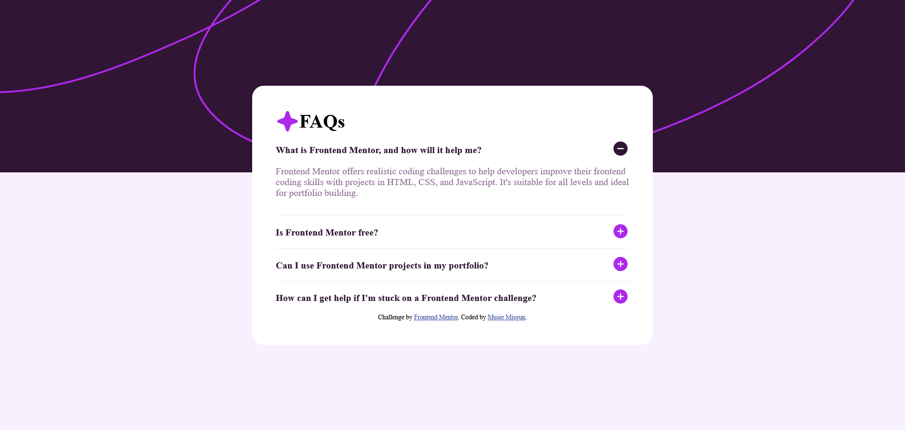
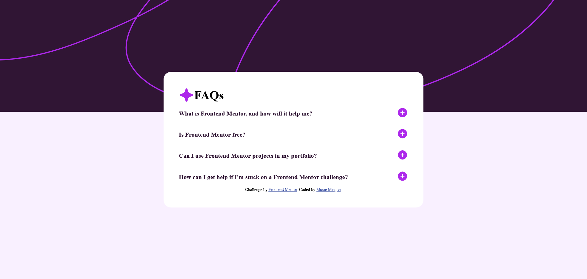

# Frontend Mentor - FAQ accordion solution

This is a solution to the [FAQ accordion challenge on Frontend Mentor](https://www.frontendmentor.io/challenges/faq-accordion-wyfFdeBwBz). Frontend Mentor challenges help you improve your coding skills by building realistic projects.

## Table of contents

- [Overview](#overview)
  - [The challenge](#the-challenge)
  - [Screenshot](#screenshot)
  - [Links](#links)
- [My process](#my-process)
  - [Built with](#built-with)
  - [What I learned](#what-i-learned)
  - [Continued development](#continued-development)
  - [Useful resources](#useful-resources)
- [Author](#author)

**Note: Delete this note and update the table of contents based on what sections you keep.**

## Overview

### The challenge

Users should be able to:

- Hide/Show the answer to a question when the question is clicked
- Navigate the questions and hide/show answers using keyboard navigation alone
- View the optimal layout for the interface depending on their device's screen size
- See hover and focus states for all interactive elements on the page

### Screenshot





### Links

- Solution URL: [Add solution URL here](https://your-solution-url.com)
- Live Site URL: [Add live site URL here](https://your-live-site-url.com)

## My process

### Built with

- Semantic HTML5 markup
- CSS custom properties
- Flexbox

### What I learned

Use this section to recap over some of your major learnings while working through this project. Writing these out and providing code samples of areas you want to highlight is a great way to reinforce your own knowledge.

To see how you can add code snippets, see below:

```js
//to toggle between plus and minus
let minus = eachContent.querySelector(".minus");
minus.classList.toggle("hidden");
let plus = eachContent.querySelector(".plus");
plus.classList.toggle("hidden");
```

### Continued development

In the future I want to perfect to make my js code efficient as much as possible as it helps maintain a simple and maintainable code.

### Useful resources

- [Example resource 1](https://www.w3schools.com/howto/howto_js_toggle_class.asp) - This helps on how to toggle between adding and removing a class name from an element with JavaScript.

## Author

- Website - [Musie Misgun](https://sparkling-taffy-9985b2.netlify.app/)
- Frontend Mentor - [@Natty-tech](https://www.frontendmentor.io/profile/Natty-tech)
